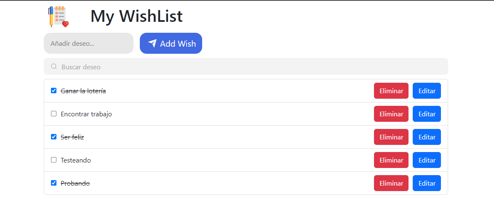

# Desarrolo Web en Entorno Cliente

## Proyecto WishList (Preview)


   
[Agustín Jiménez Polonio](https://github.com/AgusJP)

## Índice

- [Descripción del proyecto](#id1)
- [Requisitos del proyecto](#id2)
- [Instalación en local](#id3)
- [Manual de uso](#id4)
- [Licencia](#id5)

<br>

# Descripcion del proyecto. <a name="id1"></a>

My WishList trata de una Aplicación Web creada con el framework React para gestionar una lista de deseos.
Consta de diferentes funcionalidades como poder crear, eliminar, editar, ordenar... tus deseos de la manera que
más te convenga.

<br>

# Requisitos del proyecto. <a name="id2"></a>

- Incluir alguna imagen en la cabecera a modo de logo de la aplicación.
- Mostrar una lista de deseos con un checkbox que permita marcar el deseo como completado. Una vez marcado el deseo debe mostrarse diferente al resto, por ejemplo tachando el texto.
- Permitir añadir deseos nuevos simplemente pulsando la tecla intro en el campo de texto.
- Añadir un botón que también sirva para añadir el texto del nuevo deseo a la lista.
- Almacenar deseos en el almacenamiento local del navegador y recuperarlos automáticamente al abrir la aplicación.
- Eliminar un deseo concreto de la lista.
- Editar un deseo concreto de la lista, mediante la edición en línea del texto, mediante un modal, etc.
- Reordenar los deseos de la lista, arrastrando los deseos, mediante iconos para subir o bajar el deseo, etc.
- Buscar deseos, la lista se filtrará mostrando sólo los que correspondan con la búsqueda. Incluir algún proceso para eliminar esa búsqueda y que vuelvan a aparecer todos los deseos.

<br>

# Pasos para la instalación en local. <a name="id3"></a>

En primer lugar tendríamos que tener instalado en nuestro equipo Nodejs, para así disponer de su gestor de paquetes npm.

Una vez instalado node, una forma de tener el código del repositorio en nuestro equipo, podría ser clonándolo con la siguiente instrucción:

```
git clone https://github.com/AgusJP/WishList.git
```

Una vez clonado el repositorio faltaría instalar todas las dependencias que en este se incluyen. Todos los comandos mostrados a partir de este momento se deberan ejecutar dentro de la carpeta contenedora del mismo.

```
npm install
```

Una vez ejecutado este comando la Aplicación estaría preparada para su correcto funcionamiento.

Para generar la documentación del proyecto tendremos que ejecutar el siguiente comando previamente configurado para su correcto funcionamiento en package.json ("docs": "jsdoc -R ./README.md -d ./doc ./src/")

```
npm run docs
```

 <br>

# ¿Cómo ejecuto el proyecto? <a name="id4"></a>

Una vez tengamos todas las dependencia instaladas, iniciamos el proyecto con el siguiente comando:

```
npm run start
```

Si queremos construir una versión en producción utilizaremos este comando:

```
npm run build
```

Este comando nos generará un código en producción dentro de una carpeta dist. Si queremos ejecutar este código de producción como una pequeña demo ejecutaremos el siguiente comando:

```
npm run preview
```

 <br>

# Licencia (MIT License)<a name="id5" ></a>

Una licencia permisiva breve y simple con condiciones que solo requieren la preservación de los avisos de derechos de autor y licencia. Los trabajos con licencia, las modificaciones y los trabajos más grandes pueden distribuirse bajo diferentes términos y sin código fuente.

## Con esta licencia está permitido:

- Uso comercial.
- Modificación.
- Distribución.
- Uso privado.

## Limitaciones:

- Responsabilidad
- Garantía

# Author

[Agustín Jiménez Polonio](https://github.com/AgusJP)

<br>
